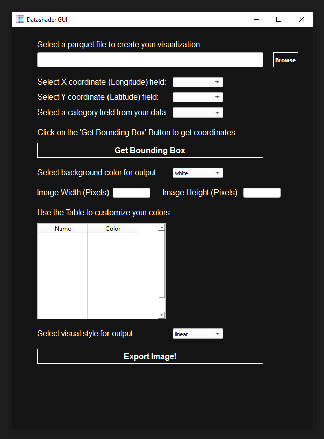
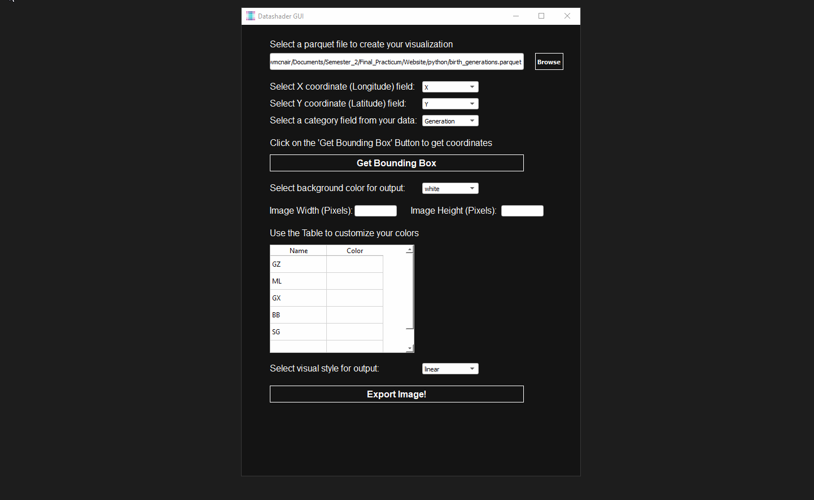
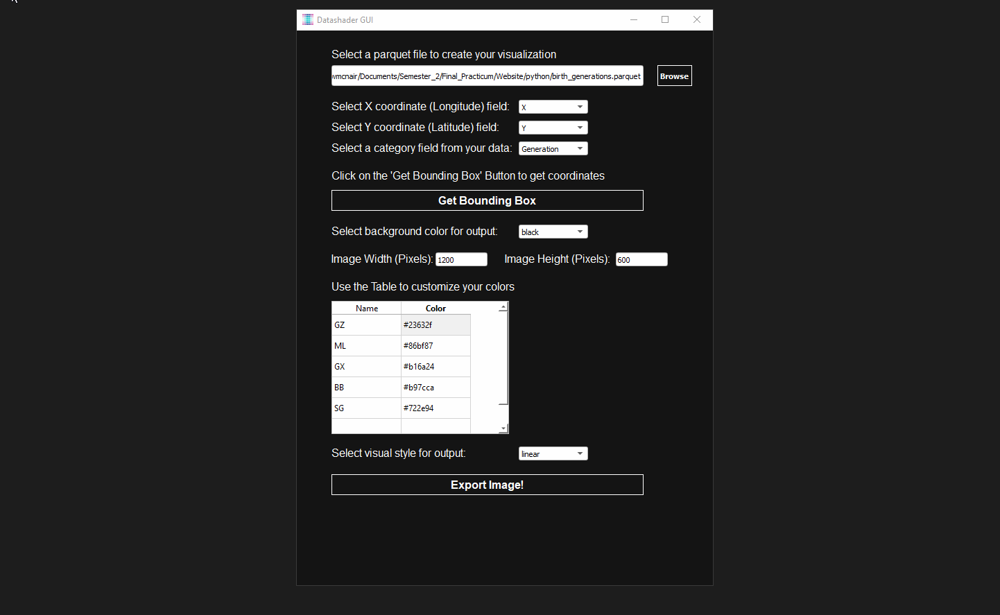

# DatashaderGUI
This is version 1 of the Datashader Graphical User Interface (GUI). The purpose of this project is to use the Datashader Python Package with a GUI framework. The following python packages are needed for this to run (Python 3 needed):
- datashader (https://datashader.org/)
- pyarrow (https://arrow.apache.org/docs/python/install.html)
- pandas (https://pandas.pydata.org/)
- PyQt5 (https://pypi.org/project/PyQt5/)
- folium (https://python-visualization.github.io/folium/)
- functools (https://docs.python.org/3/library/functools.html)

Below is a list of instructions to run the GUI in order to achieve desired output.

1. Run the Python script and wait for the GUI to appear. You should see something like this image below.

2. Click on the "browse" button to select a parquet file. Only parquet files are read in this version. Depending on the size of your file, it could take a few seconds for it to load onto the GUI.

3. Once the parquet file is read, you should see the X, Y, and category dropdown automatically fill up based on the column header names of the dataset. Go ahead and make sure they are filled in correctly. Please not that this version only reads XY coordinates in WGS 84 coordinate system.

4. Selecting the category field may take a few seconds for the GUI to load, as it will automatically fill in the unique values onto the table below. Once that is done, go ahead and get the bounding box coordinates of the area the data overlays. You can draw a rectangle over area of interest and click on the export button twice. The default bounding box coordinates overlays the continental United States.

5. Before selecting the desired colors for each category, go ahead and select the background color (black or white), and enter the dimensions you want for the exported image (in pixels)

6. Now, go ahead and fill in the colors in the table. They can be in hex (ex: #000000) or a regular color text (ex: red).

7. When done, select method of visualization you want the data to be exported as. It can either be linear, log, or equal histogram. After selecting the type, go ahead and export the image! Give the GUI a few seconds, but an image should pop-up with your results!

Below is an example export from using the GUI. This is where all the people in the continental U.S. based on birth generation (Silent Generation, Baby Boomer, Generation X, Millennials, and Generation Z). The more purple, the older the generation. The more green, the younger. For more information about how I got this data, visit my other repository: https://github.com/Kyle-McNair/birth-generation-map

